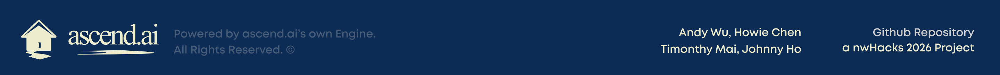

# ascend.ai - A Personalized Financial Advisor Engine

<div align="center">
  
</div>

<div align="center">

**A personalized financial decision advisor that generates actionable roadmaps based on your financial profile.**

Ascend.ai is a full-stack application featuring a custom-built recommendation engine that analyzes user financial profiles and generates personalized, staged roadmaps with logical dependencies. Built for nwHacks 2026.

</div>

## Table of Contents

- [Overview](#overview)
- [Features](#features)
- [Architecture](#architecture)
- [Installation](#installation)
- [Usage](#usage)
- [API Documentation](#api-documentation)
- [Project Structure](#project-structure)
- [Development](#development)
- [Configuration](#configuration)
- [Testing](#testing)
- [Deployment](#deployment)
- [Contributing](#contributing)
- [License](#license)

---

## Overview

<div align="center">
  
</div>

Ascend.ai solves the problem of inaccessible, expensive, or generic financial advice by providing a personalized recommendation engine that adapts to each user's unique financial situation. The system combines structured heuristic logic with intelligent personalization to deliver transparent, actionable financial guidance.

### Key Differentiators

- **Custom Recommendation Engine**: Built from scratch, not a wrapper around generic APIs
- **Dependency-Aware Recommendations**: Uses DAG (Directed Acyclic Graph) structure to ensure logical action sequencing
- **Multi-Factor Scoring**: Evaluates recommendations across 8 weighted dimensions
- **Real-Time Adaptation**: Instant roadmap updates when users adjust their profile
- **Transparent & Explainable**: Every recommendation includes score breakdowns and reasoning

---

## Features

### User Features

- **Personalized Financial Roadmaps**: Staged recommendations organized by time horizon (Short-Term, Medium-Term, Long-Term)
- **Interactive Profile Management**: Adjust age, income, debt, and investments with real-time roadmap updates
- **Risk Tolerance Slider**: Visual slider to set risk preference (Low/Medium/High) with instant adaptation
- **Dependency Visualization**: Interactive node graph showing how actions connect and depend on each other
- **Educational Resources**: Curated links to trusted financial resources for each recommendation
- **User Authentication**: Secure login via Firebase with Google OAuth
- **Profile Setup**: Comprehensive onboarding to capture financial situation

### Technical Features

- **Modular Engine Architecture**: Extensible components for easy customization
- **RESTful API**: Clean, documented endpoints for engine integration
- **Sub-100ms Response Times**: Optimized for real-time updates
- **Input Normalization**: Handles diverse input formats intelligently
- **Dynamic Action Generation**: Creates personalized goals based on user context
- **Cycle Detection**: Ensures logical consistency in recommendation sequences

---

## Architecture

### System Overview

<div align="center">
  
</div>

### Engine Components

#### 1. Input Normalizer & Profile Analyzer
- Handles diverse input formats (ranges, free text, categorical)
- Normalizes financial data into standardized metrics
- Computes financial health indicators
- Creates evaluation context for downstream components

#### 2. Action Registry System
- Extensible registry of 50+ financial actions
- Each action includes: category, risk level, expected return, effort hours, complexity, dependencies
- Dynamic action generation based on user goals
- Filtering system for applicable actions

#### 3. Multi-Factor Scorer
Evaluates each action across 8 weighted dimensions:
- Base Priority (0-100)
- Risk Alignment
- Goal Alignment
- Profile Fit
- Urgency Score
- Impact Potential
- Feasibility Score
- Priority Area Match

#### 4. DAG Builder & Optimizer
- Constructs dependency graph of financial actions
- Cycle detection and resolution
- Topological sorting for optimal sequencing
- Path optimization and parallel action identification

#### 5. Recommendation Engine
- Groups scored actions by time horizon
- Applies diversity filters
- Generates sequential paths
- Creates personalized descriptions

#### 6. Personalization Layer
- Adds estimated timelines
- Generates contextual descriptions
- Adjusts language based on financial literacy

---

## Installation

### Prerequisites

- **Node.js** (v16 or higher)
- **Python** (3.10 or higher)
- **npm** or **yarn**
- **Firebase account** (for authentication)

### Step 1: Clone the Repository

```bash
git clone https://github.com/yourusername/ascend.ai.git
cd ascend.ai
```

### Step 2: Set Up Firebase

1. Create a Firebase project at [Firebase Console](https://console.firebase.google.com/)
2. Enable Google Authentication
3. Create a Firestore database
4. Copy your Firebase configuration

### Step 3: Configure Frontend

```bash
cd client
npm install
```

Create a `.env` file in the `client` directory:

```env
REACT_APP_ENGINE_API_URL=http://localhost:5001/api
REACT_APP_FIREBASE_API_KEY=your_api_key
REACT_APP_FIREBASE_AUTH_DOMAIN=your_auth_domain
REACT_APP_FIREBASE_PROJECT_ID=your_project_id
REACT_APP_FIREBASE_STORAGE_BUCKET=your_storage_bucket
REACT_APP_FIREBASE_MESSAGING_SENDER_ID=your_sender_id
REACT_APP_FIREBASE_APP_ID=your_app_id
```

Update `client/src/firebase.js` with your Firebase configuration.

### Step 4: Set Up Engine Backend

```bash
cd engine
pip install flask flask-cors
```

Or install from requirements:

```bash
pip install -r requirements.txt
```

### Step 5: Start the Services

**Terminal 1 - Start Engine API:**
```bash
cd engine
python api.py
```

The engine API will start on `http://localhost:5001`

**Terminal 2 - Start React Frontend:**
```bash
cd client
npm start
```

The frontend will start on `http://localhost:3000`

---

## Usage

### For End Users

1. **Landing Page**: Visit the application and click anywhere to continue
2. **Authentication**: Sign in with Google to create an account
3. **Profile Setup**: Complete your financial profile:
   - Age range
   - Location
   - Property value
   - Vehicle value
   - Investments
   - Debt
   - Monthly salary
   - Dependents status
4. **User Input**: Provide your financial situation:
   - Current situation (free text)
   - Future goals (free text)
   - Risk tolerance (slider: Low/Medium/High)
5. **Explore Roadmap**: View your personalized recommendations organized by time horizon
6. **Adjust Profile**: Use the toggles in the visualization page to adjust your profile and see real-time updates

### For Developers

#### Using the Engine Directly

```python
from engine import AscendEngine, create_profile, create_query

# Create user profile
profile = create_profile(
    age_range="30-34",
    location="Vancouver, BC",
    monthly_salary="$4k-$5k",
    debt="$25k-$50k",
    investments="$5k-$10k",
    has_dependents=False
)

# Create query
query = create_query(
    risk_tolerance="medium",
    current_situation="I have student loans and some savings",
    goal="Pay off debt and start investing"
)

# Initialize engine
engine = AscendEngine()

# Generate recommendations
result = engine.process(profile, query)

# Access recommendations
print("Short-term actions:", len(result.short_term))
print("Medium-term actions:", len(result.medium_term))
print("Long-term actions:", len(result.long_term))
```

#### Using the REST API

```bash
# Health check
curl http://localhost:5001/api/health

# Get recommendations
curl -X POST http://localhost:5001/api/recommend \
  -H "Content-Type: application/json" \
  -d '{
    "age_range": "30-34",
    "monthly_salary": "$4k-$5k",
    "debt": "$25k-$50k",
    "investments": "$5k-$10k",
    "risk_tolerance": "medium",
    "current_situation": "I have student loans",
    "goal": "Pay off debt and start investing"
  }'
```

---

## API Documentation

### Engine API Endpoints

#### `GET /api/health`

Health check endpoint.

**Response:**
```json
{
  "status": "ok",
  "engine": "Ascend Engine v1.0"
}
```

#### `POST /api/recommend`

Generate personalized financial recommendations.

**Request Body:**
```json
{
  "age_range": "30-34",
  "location": "Vancouver, BC",
  "property_value": "prefer_not_to_say",
  "vehicle_value": "prefer_not_to_say",
  "investments": "$5k-$10k",
  "debt": "$25k-$50k",
  "monthly_salary": "$4k-$5k",
  "has_dependents": false,
  "employment_stability": 0.7,
  "risk_tolerance": "medium",
  "current_situation": "I have student loans and some savings",
  "goal": "Pay off debt and start investing"
}
```

**Response:**
```json
{
  "immediate": [...],
  "short_term": [
    {
      "action_id": "action_001",
      "name": "Build Emergency Fund",
      "description": "Start building an emergency fund...",
      "personalized_description": "Given your $4k-$5k monthly income...",
      "score": 85.5,
      "score_breakdown": {...},
      "prerequisites": [],
      "estimated_timeline": "3-6 months"
    }
  ],
  "medium_term": [...],
  "long_term": [...],
  "extended_term": [...],
  "sequential_path": [...],
  "profile_summary": {...},
  "processing_time_ms": 45.2
}
```

---

## Project Structure

```
ascend.ai/
├── client/                 # React frontend
│   ├── public/           # Static assets
│   ├── src/
│   │   ├── components/    # React components
│   │   │   ├── AccountPage/
│   │   │   ├── ProfileSetup/
│   │   │   ├── UserInputPage/
│   │   │   └── Visualization/
│   │   ├── App.js        # Main app component
│   │   ├── firebase.js   # Firebase configuration
│   │   └── index.js      # Entry point
│   └── package.json
│
├── engine/                # Python recommendation engine
│   ├── api.py           # Flask REST API
│   ├── core/            # Core engine components
│   │   ├── engine.py           # Main orchestrator
│   │   ├── normalizer.py       # Input normalization
│   │   ├── action_registry.py  # Action registry
│   │   ├── scorer.py           # Multi-factor scorer
│   │   ├── dag_builder.py      # DAG construction
│   │   └── recommender.py      # Recommendation generation
│   ├── models/          # Data models
│   ├── utils/           # Utility functions
│   ├── config/          # Configuration files
│   │   └── actions.json # Action definitions
│   └── requirements.txt
│
├── server/               # Optional Node.js server
│   └── src/
│       └── index.js
│
├── .gitignore
├── LICENSE
└── README.md
```

---

## Development

### Development Setup

1. **Install Dependencies**

```bash
# Frontend
cd client
npm install

# Backend
cd engine
pip install -r requirements.txt
```

2. **Environment Variables**

Set up environment variables as described in the Installation section.

3. **Run in Development Mode**

```bash
# Terminal 1: Engine API (with auto-reload)
cd engine
python api.py  # Flask runs in debug mode

# Terminal 2: React Frontend (with hot reload)
cd client
npm start
```

### Code Structure

#### Frontend Components

- **App.js**: Main application component with routing and state management
- **ProfileSetup/**: Multi-step profile setup with confirmation
- **UserInputPage/**: Financial situation and goals input with risk slider
- **Visualization/**: Interactive roadmap visualization with profile toggles
- **AccountPage/**: User account management

#### Engine Components

- **engine.py**: Main orchestrator that coordinates all components
- **normalizer.py**: Input normalization and profile analysis
- **action_registry.py**: Action registry and filtering
- **scorer.py**: Multi-factor scoring algorithm
- **dag_builder.py**: DAG construction and optimization
- **recommender.py**: Recommendation generation and grouping

### Adding New Financial Actions

1. Edit `engine/config/actions.json`
2. Add a new action with required fields:
```json
{
  "id": "action_xxx",
  "name": "Action Name",
  "description": "Action description",
  "category": "savings",
  "risk_level": "low",
  "horizon": "short_term",
  "dependencies": [],
  "base_priority": 75,
  "parameters": {}
}
```
3. Restart the engine API

### Customizing Scoring Weights

```python
from engine.models import ScoringWeights
from engine.core.engine import AscendEngine

# Create custom weights
weights = ScoringWeights(
    base_priority_weight=0.15,
    risk_tolerance_weight=0.20,
    goal_alignment_weight=0.25,
    profile_fit_weight=0.15,
    urgency_weight=0.10,
    impact_weight=0.10,
    feasibility_weight=0.05
)

# Initialize engine with custom weights
engine = AscendEngine(scoring_weights=weights)
```

---

## Configuration

### Engine Configuration

The engine can be configured through:

1. **Actions Configuration**: `engine/config/actions.json`
2. **Scoring Weights**: Passed during engine initialization
3. **API Settings**: Modified in `engine/api.py`

### Frontend Configuration

- **API URL**: Set via `REACT_APP_ENGINE_API_URL` environment variable
- **Firebase**: Configured in `client/src/firebase.js`

---

## Testing

### Engine Testing

```bash
cd engine
python -m pytest tests/
```

### Frontend Testing

```bash
cd client
npm test
```

### Manual Testing

1. Test profile setup flow
2. Test risk slider interaction
3. Test real-time roadmap updates
4. Test API endpoints with curl or Postman

---

## Deployment

### Frontend Deployment (Vercel/Netlify)

1. Build the React app:
```bash
cd client
npm run build
```

2. Deploy the `build` folder to your hosting service

3. Set environment variables in your hosting platform

### Engine API Deployment

#### Option 1: Heroku

1. Create `Procfile`:
```
web: python engine/api.py
```

2. Deploy:
```bash
heroku create ascend-engine
git push heroku main
```

#### Option 2: Docker

1. Create `Dockerfile`:
```dockerfile
FROM python:3.10
WORKDIR /app
COPY engine/ .
RUN pip install flask flask-cors
EXPOSE 5001
CMD ["python", "api.py"]
```

2. Build and run:
```bash
docker build -t ascend-engine .
docker run -p 5001:5001 ascend-engine
```

#### Option 3: AWS/GCP/Azure

Deploy as a containerized service or serverless function following your cloud provider's documentation.

---

## Contributing

We welcome contributions! Please follow these steps:

1. Fork the repository
2. Create a feature branch (`git checkout -b feature/amazing-feature`)
3. Commit your changes (`git commit -m 'Add some amazing feature'`)
4. Push to the branch (`git push origin feature/amazing-feature`)
5. Open a Pull Request

### Contribution Guidelines

- Follow existing code style and conventions
- Add tests for new features
- Update documentation as needed
- Ensure all tests pass before submitting

---

## License

This project is licensed under the MIT License - see the [LICENSE](LICENSE) file for details.

---

## Acknowledgments

- Built for nwHacks 2026
- Inspired by the need for accessible, personalized financial advice
- Thanks to the open-source community for excellent tools and libraries


## Roadmap

### Short-Term
- [ ] Add more financial actions to registry
- [ ] Integrate financial APIs for automatic profile updates
- [ ] Add progress tracking and milestone celebrations
- [ ] Improve mobile responsiveness

### Medium-Term
- [ ] Machine learning integration for improved personalization
- [ ] A/B testing framework for recommendation optimization
- [ ] Analytics dashboard for recommendation effectiveness
- [ ] Multi-user support (couples, families)

### Long-Term
- [ ] Regulatory compliance modules
- [ ] Mobile SDK for app integration
- [ ] White-label solution for financial institutions
- [ ] Advanced tax optimization strategies

---

<div align="center">

*ascend.ai allows you to make the right steps so that you can reach your next financial peak.*

</div>

<div align="center">
  
</div>
